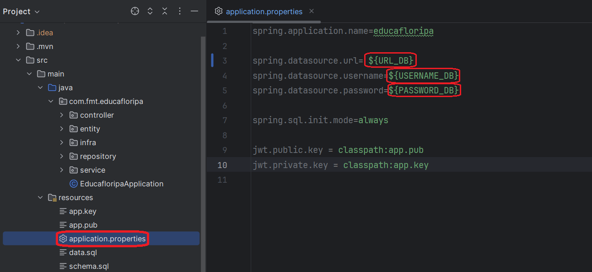

# educa-floripa

## Descrição

### Tecnologias Utilizadas

- [Java](https://www.oracle.com/java/)
- [Spring](https://spring.io/)
  - [Spring Security](https://spring.io/projects/spring-security)
  - [Spring Boot](https://spring.io/projects/spring-boot)

### Funcionalidade do Projeto

O educa-floripa tem a finalidade de gerenciar as turmas, cursos, funcionários, 
notas e alunos de uma instituição de ensino. O programa pode ser utilizado
tanto pelos alunos quando pelos funcionários da escola, tendo diversas 
restrições a depender de qual usuário está utilizando o sistema.

## Instruções de Uso

### Instalação

- Clone esse repositório do Github e abra-o em uma IDE de sua preferência (garante que você está na branch main);
```bash
git clone https://github.com/ArthurFerreiraBorba/educa-floripa.git
```
- Crie um banco de dados PostgreSQL em sua máquina;

- No arquivo application.properties substitui as partes o username, password e url pelos do banco de dados criado anteriormente;

  

- Abra o Postman e importe este [arquivo](projeto%20educa-floripa.postman_collection.json) (ele possui todos os endpoints do projeto);

- Apos todos esses passos o programa já está pronto para uso, aproveite!

## Acessos

### Níveis de Acesso / Papeis

- **ADM**: pode acessar tudo.
- **PEDAGOGICO**: pode acessar tudo sobre turma, curso, professor e aluno, não pode deletar dados.
- **RECRUITER**: pode acessar tudo sobre professor, não pode deletar dados.
- **PROFESSOR**: pode acessar tudo sobre notas, não pode deletar dados.
- **ALUNO**: apenas acessa as suas próprias notas e a pontuação total pessoal, não pode deletar dados.

### Credenciais de Administrador

- Id: 1
- Login: admin
- Senha: 1234

## Endpoints

Todos os endpoints menos o `usuarios/login` requerem um toquem de acesso.

<details>

<summary>usuário</summary>

### POST

#### `usuarios/cadastro`

Este endpoint requer as informações de um usuário para cria um novo usuário.

#### Corpo da requisição

```json 
{
  "login": "login do usuário",
  "senha": "senha do usuário",
  "papel": "nome ou id do papel"
}
```

#### `usuarios/login`

Este endpoint requer o login e senha de um usuário para retorna um token de acesso dele.

#### Corpo da requisição

```json 
{
  "login": "login do usuário",
  "senha": "senha do usuário"
}
```

</details>
<details>

<summary>aluno</summary>

### GET

#### `alunos/buscar/{id}`

Este endpoint busca um aluno através do id.

#### URL da requisição

O campo {id} deve ser substituído pelo id do aluno.

#### `alunos/buscar`

Este endpoint retorna uma lista com todos os alunos.

#### `alunos/pontuacao`

Este endpoint retorna a pontuação do aluno que fez a requisição.

### POST

#### `alunos/criar`

Este endpoint requer as informações de um aluno para cria um novo aluno.

#### Corpo da requisição

Deve der colocado o id do usuário no campo "usuario";

Deve der colocado o id da turma no campo "turma".

```json 
{
  "nome": "nome do aluno",
  "dataNascimento": "2000-05-11",
  "turma": 1,
  "usuario": 1
}
```

### DELETE

#### `alunos/deletar/{id}`

Este endpoint deleta um aluno através do id.

#### URL da requisição

O campo {id} deve ser substituído pelo id do aluno.

### PUT

#### `alunos/atualizar/{id}`

Este endpoint atualiza as informações de um aluno através do id.

#### URL da requisição

O campo {id} deve ser substituído pelo id do aluno.

#### Corpo da requisição

Deve der colocado o id do usuário no campo "usuario";

Deve der colocado o id da turma no campo "turma".

```json 
{
  "nome": "novo nome do docente",
  "dataNascimento": "2000-05-11",
  "turma": 1,
  "usuario": 1
}
```
</details>
<details>

<summary>docente</summary>

### GET

#### `docentes/buscar/{id}`

Este endpoint busca um docente através do id.

#### URL da requisição

O campo {id} deve ser substituído pelo id do docente.

#### `docentes/buscar`

Este endpoint retorna uma lista com todos os docentes.

### POST

#### `docentes/criar`

Este endpoint requer as informações de um docente para cria um novo docente.

#### Corpo da requisição

Deve der colocado o id do usuário no campo "usuario".

```json 
{
  "nome": "nome do docente",
  "usuario": 1
}
```

### DELETE

#### `docentes/deletar/{id}`

Este endpoint deleta um docente através do id.

#### URL da requisição

O campo {id} deve ser substituído pelo id do docente.

### PUT

#### `docentes/atualizar/{id}`

Este endpoint atualiza as informações de um docente através do id.

#### URL da requisição

O campo {id} deve ser substituído pelo id do docente.

#### Corpo da requisição

Deve der colocado o id do usuário no campo "usuario".

```json 
{
  "nome": "novo nome do docente",
  "usuario": 1
}
```

</details>
<details>

<summary>curso</summary>

### GET

#### `cursos/buscar/{id}`

Este endpoint busca um curso através do id.

#### URL da requisição

O campo {id} deve ser substituído pelo id do curso.

#### `cursos/buscar`

Este endpoint retorna uma lista com todos os cursos.

### POST

#### `cursos/criar`

Este endpoint requer as informações de um curso para cria um novo curso.

#### Corpo da requisição

```json 
{
  "nome": "nome do curso"
}
```

### DELETE

#### `cursos/deletar/{id}`

Este endpoint deleta um curso através do id.

#### URL da requisição

O campo {id} deve ser substituído pelo id do curso.

### PUT

#### `cursos/atualizar/{id}`

Este endpoint atualiza as informações de um curso através do id.

#### URL da requisição

O campo {id} deve ser substituído pelo id do curso.

#### Corpo da requisição

Deve der colocado o id do usuário no campo "usuario".

```json 
{
  "nome": "novo nome do curso"
}
```

</details>
<details>

<summary>turma</summary>


### GET

#### `turmas/buscar/{id}`

Este endpoint busca um turma através do id.

#### URL da requisição

O campo {id} deve ser substituído pelo id do turma.

#### `turmas/buscar`

Este endpoint retorna uma lista com todas as turmas.

### POST

#### `turmas/criar`

Este endpoint requer as informações de uma turma para cria um novo turma.

#### Corpo da requisição

Deve ser colocado o id do curso no campo "curso";

Deve ser colocado o id de docente no campo "professor" (o docente deve possuir o usuário com o papel de PROFESSOR).

```json 
{
  "nome": "nome da turma",
  "curso": 1,
  "professor": 1
}
```

### DELETE

#### `turmas/deletar/{id}`

Este endpoint deleta uma turma através do id.

#### URL da requisição

O campo {id} deve ser substituído pelo id do turma.

### PUT

#### `turmas/atualizar/{id}`

Este endpoint atualiza as informações de uma turma através do id.

#### URL da requisição

O campo {id} deve ser substituído pelo id do turma.

#### Corpo da requisição

Deve der colocado o id do curso no campo "curso";

Deve der colocado o id de docente no campo "professor" (o docente deve possuir o usuário com o papel de PROFESSOR).

```json 
{
  "nome": "novo nome da turma",
  "curso": 1,
  "professor": 1
}
```

</details>
<details>

<summary>matéria</summary>


### GET

#### `materias/buscar/{id}`

Este endpoint busca uma matéria através do id.

#### URL da requisição

O campo {id} deve ser substituído pelo id do matéria.

#### `materias/buscar`

Este endpoint retorna uma lista com todas as matérias.

#### `materias/buscar/curso/{idCurso}`

Este endpoint busca matérias através de curso.

#### URL da requisição

O campo {idCurso} deve ser substituído pelo id do curso.

### POST

#### `matérias/criar`

Este endpoint requer as informações de uma matéria para cria um novo matéria.

#### Corpo da requisição

Deve der colocado o id do curso no campo "curso".

```json 
{
  "nome": "nome da matéria",
  "curso": 1
}
```

### DELETE

#### `matérias/deletar/{id}`

Este endpoint deleta uma matéria através do id.

#### URL da requisição

O campo {id} deve ser substituído pelo id do matéria.

### PUT

#### `matérias/atualizar/{id}`

Este endpoint atualiza as informações de uma matéria através do id.

#### URL da requisição

O campo {id} deve ser substituído pelo id da matéria.

#### Corpo da requisição

Deve der colocado o id do curso no campo "curso".

```json 
{
  "nome": "novo nome da matéria",
  "curso": 1
}
```

</details>
<details>

<summary>nota</summary>

### GET

#### `notas/buscar/{id}`

Este endpoint busca uma nota através do id.

#### URL da requisição

O campo {id} deve ser substituído pelo id da nota.

#### `notas/buscar`

Este endpoint retorna uma lista com todas as notas.

#### `notas/buscar/aluno/{idAluno}`

Este endpoint busca notas através de aluno.

#### URL da requisição

O campo {idAluno} deve ser substituído pelo id do aluno.

### POST

#### `notas/criar`

Este endpoint requer as informações de uma nota para cria um novo nota.

#### Corpo da requisição

Deve der colocado o id do aluno no campo "aluno";

Deve der colocado o id da matéria no campo "materia".

```json 
{
  "valor": 100,
  "aluno": 1,
  "materia": 1
}
```

#### Aviso

O curso da turma do aluno deve ser o mesmo curso da matéria;

O professor que fez a requisição deve estar na mesma turma que o aluno.

### DELETE

#### `notas/deletar/{id}`

Este endpoint deleta um nota através do id

#### URL da requisição

O campo {id} deve ser substituído pelo id do nota

### PUT

#### `notas/atualizar/{id}`

Este endpoint atualiza as informações de uma nota através do id

#### URL da requisição

O campo {id} deve ser substituído pelo id do nota

#### Corpo da requisição

Deve der colocado o id do aluno no campo "aluno";

Deve der colocado o id da matéria no campo "materia".

```json 
{
  "valor": 50.5,
  "aluno": 1,
  "materia": 1
}
```

#### Aviso

O curso da turma do aluno deve ser o mesmo curso da matéria;

O professor que fez a requisição deve estar na mesma turma que o aluno.

</details>

## Equipe

[Arthur Ferreira Borba](https://github.com/ArthurFerreiraBorba)